# 尚硅谷springcloud2025从入门到大牛

## 简介微服务的由来

- 传统的单体应用
  传统的单一架构意味着一个处理请求服务器和一个数据库服务器，这种架构的优点是简单，但是随着业务的发展，单体应用的缺点也逐渐暴露出来，比如：
    - 代码耦合度高、臃肿
    - 部署麻烦
    - 可维护性差
    - 可靠性差
    - 无法快速响应业务需求
- 集群架构

为处理高并发的请求，系统部署在多台服务器上，用户通过访问域名网站，由负载均衡器将请求动态分发到不同的服务器上。
集群架构是物理层面上的定义，多台服务器就可以实现。

- 分布式架构

分布式架构是逻辑层面上的定义，将一个大的系统拆分成多个子系统，每个子系统都可以独立部署，独立运行，独立维护。
但是存在一些问题：
- 注册中心：服务的注册与发现 配置中心：配置的统一管理 nacos
- gateway：服务的网关，前端请求的统一入口
- openfeign：服务之间的调用，例：用户服务调用订单服务
- 熔断器：服务的降级与熔断 sentinel
- seata：分布式事务：订单服务调用库存服务，同时成功或失败

## 1. springcloud项目架构

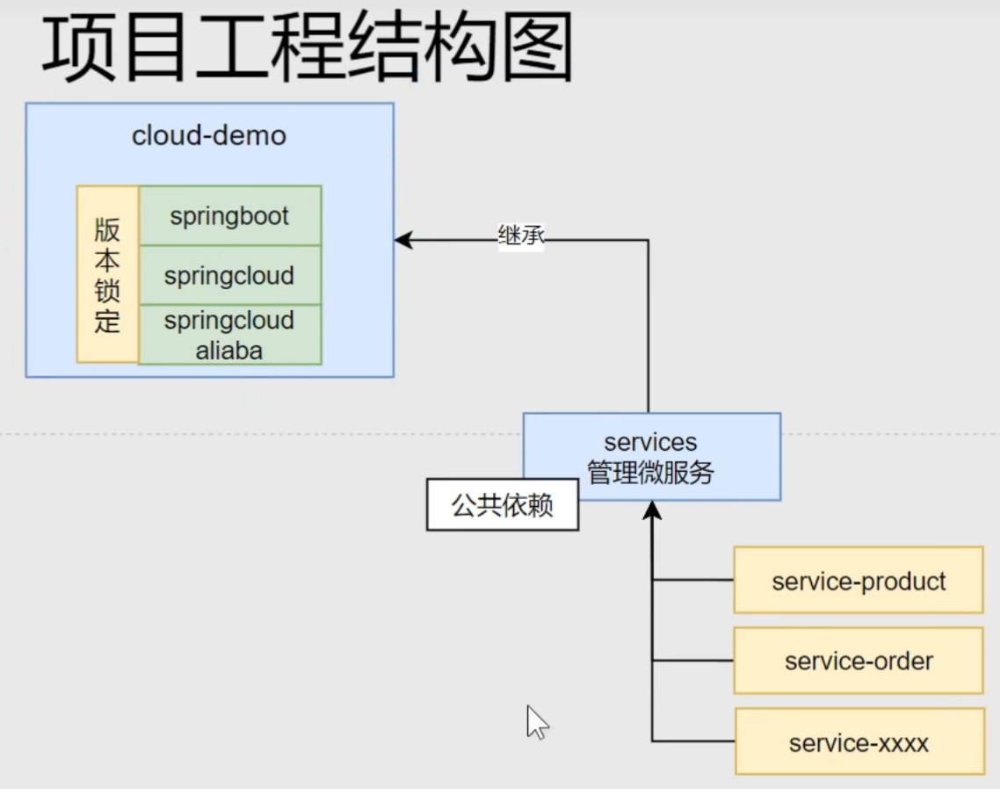

### 1.1 项目创建并修改pom.xml文件进行版本管理

- 创建父工程
  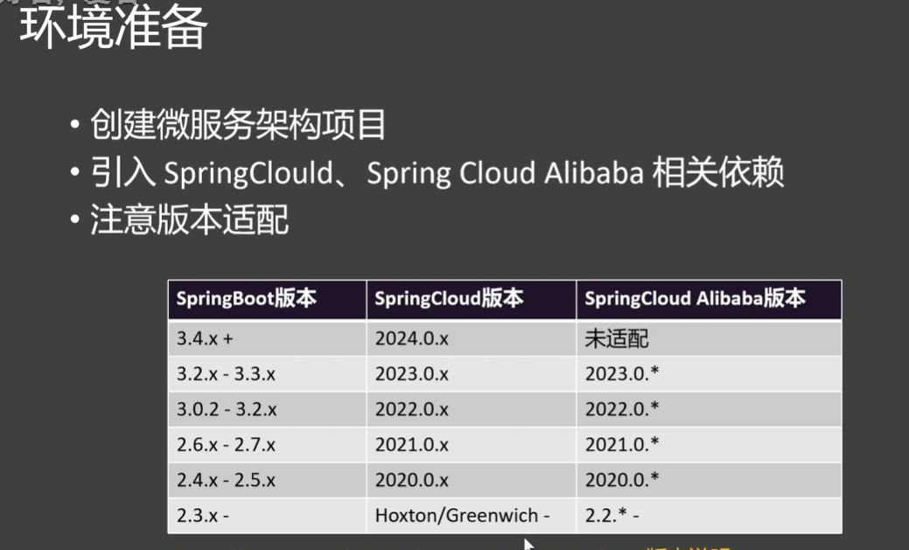
  首先创建一个父工程选择springboot即可，后续修改父目录下的pom.xml锁定项目版本
- java模板创建services模块
- java模板创建services下不同的微服务模块：product、order、user
- 微服务模块都需要使用nacos、openfeign组件，因此在services模块中导入依赖，具体见https://www.yuque.com/leifengyang 速通springcloud简介

## 2. nacos

### 2.1 nacos的安装与使用
nacos官网下载，这里我在语雀上有详细的安装教程，具体见https://www.yuque.com/leifengyang 速通springcloud简介。然后类似于redis需要手动启动服务器，
启动指令：`startup.cmd -m standalone`，然后访问http://localhost:8848/nacos即可进入nacos的控制台。

### 2.2 nacos的服务注册
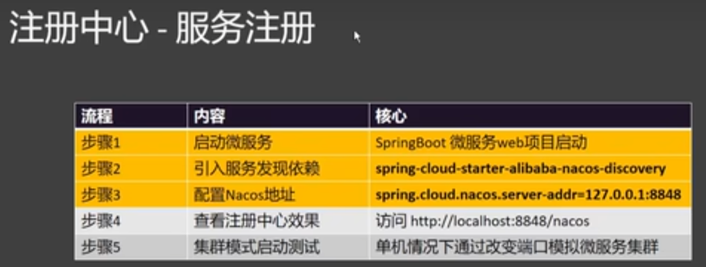
！！nacos需要web项目支持，因此在每个微服务pom.xml中导入web依赖，自行创建com.atguigu.xxxx.xxxxMainApplication启动类，
！并且创建一个配置文件配置spring.application.name、server.port、spring.cloud.nacos.discovery.server-addr，然后在nacos控制台中注册服务即可。
- 暂时没有实现集群（只有本地机器），这里可以通过复制服务创建多个实例，但必须修改参数端口号
- 配置文件中不能有空格

### 2.3 nacos的服务发现
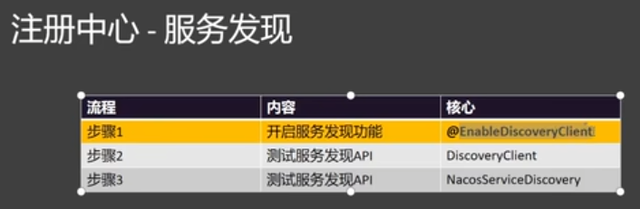
实现步骤1，需要对启动类加上一个注解@EnableDiscoveryClient即可，步骤2，3注入对应的对象调用api即可（代码可见测试类），实际开发已经被自动封装了所以了解即可。

### 2.4 远程调用基本实现
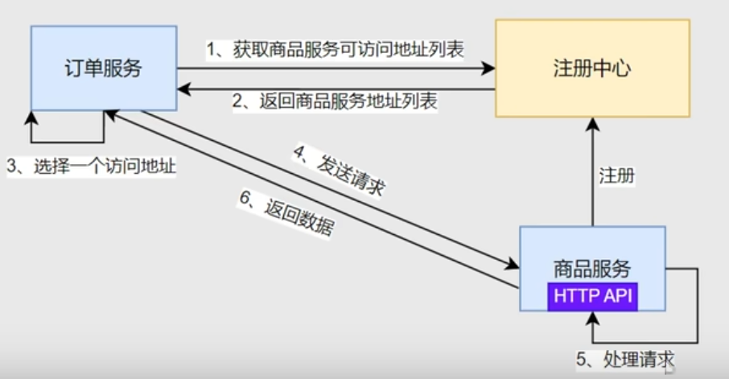
远程调用即两个微服务之间的调用，比如商品服务调用订单服务，这里需要注意！！公共bean模板保存在新建的model模块中并导入lombok坐标。
调用流程：1.通过DiscoveryClient获取对应服务的实例，并且获取实例的ip和端口号，2.通过RestTemplate发送请求。（这里是通过新建一个配置类实现自动注入的方式）
- 出现错误：程序不能正常运行也没有报错

### 2.5 远程调用实现步骤
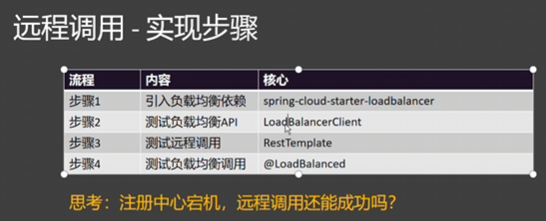
有三种实现方式：
- 1.就是2.4实现的手动选择；
- 2.！！（后两种需要导入loadbalancer坐标）2.通过loadBalancerClient实现负载均衡；
- 3.基于注解的实现，在RestTemplate注入上加上@LoadBalanced即可实现负载均衡。  
进阶3：基于注解的负载均衡：在RestTemplate注入时加入注解@loadbalanced。 第一次调用流程：1.从url中找到微服务名，2.请求注册中心服务发现，3.保存到缓存（动态更新）并使用负载均衡算法选择实例，4.远程调用。 后续访问：直接访问缓存中的实例
面试题：如果注册中心宕机了，还能远程调用吗？ 注册中心宕机意味着无法进行服务发现和注册，前面两种无法调用，但是如果使用注解方式有可能，因为其底层使用缓存机制，即如果之前调用过，会保存下来，后续之间访问缓存。

### 2.6 nacos的配置中心  
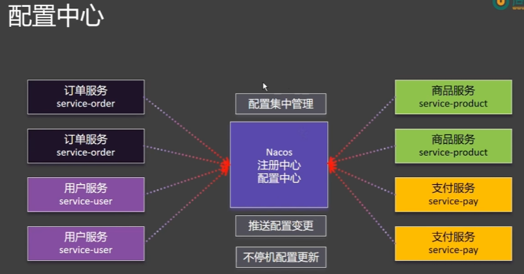
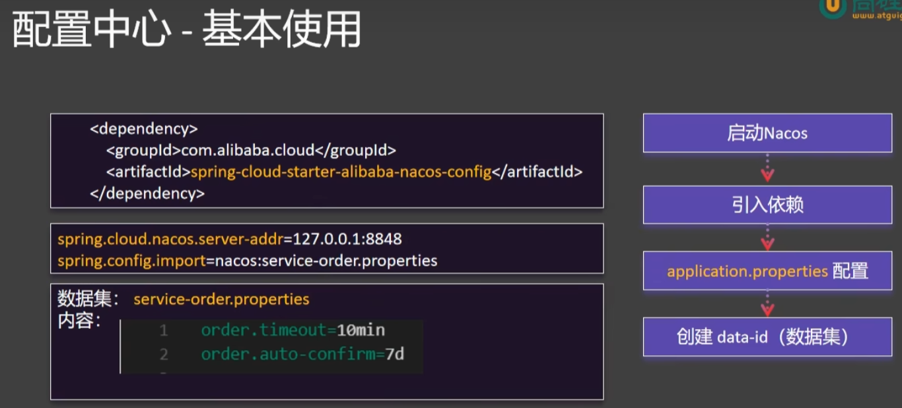
配置中心的使用：
1. 因为所有微服务都要用配置中心，因此在services模块中导入依赖nacos配置中心
2. 在微服务配置文件中配置spring.config.import=nacos:xxxxx，这里xxxxx是nacos的配置文件的Data ID。！！！！！这里其实就已经把配置文件中的内容导入了，后续只不过是解决如何读及动态刷新的问题。
3. 启动nacos后，在nacos控制台（http://localhost:8848/nacos ）中创建配置文件:Data ID:service-order.properties 配置内容（properties）：order.timeout=30min
   order.auto-confirm=7d
4. 在微服务启动类中加上注解@RefreshScope，这样配置文件的内容就会自动刷新，并且可以通过注解@Value("${order.timeout}")String timeout;注入配置文件的内容。

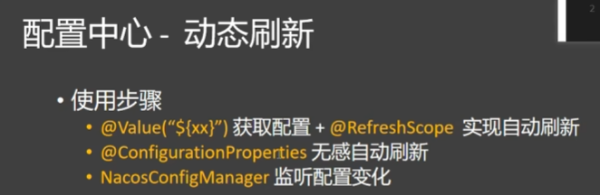
方法2基于注解无感自动刷新：配置动态刷新替换上面的步骤4
1. 创建一个新的Bean配置类：properties.OrderProperties,并且加上注解@ConfigrationProperties(prefix = "order")，prefix匹配的是配置内容的前缀,这样就可以直接注入配置文件的内容并且是自动刷新。
2. 如果要使用配置，注解@Autowire OrderProperties orderProperties;即可。

方法3基于NacosConfigManager编码的方式实现动态刷新：配置动态刷新替换上面的步骤4
1. 在启动类中注入NacosConfigManager，然后调用其addListener方法，监听配置文件的变化，然后在监听器中实现动态刷新的逻辑。
2. 比方法2多了一个Group参数，这个参数是配置文件的分组，一般默认为DEFAULT_GROUP。
```java
/*
    * 编码方式实现配置文件的动态刷新
    * 1. 启动类已启动就开启配置监听  加上Bean注解，程序启动时会自动调用方法，并且方法参数会从容器中直接拿取
    * 2. 获取变化值
    * 3. 发送邮件
    * */
    @Bean
    ApplicationRunner applicationRunner(NacosConfigManager nacosConfigManager){
        return args -> {
            ConfigService configService = nacosConfigManager.getConfigService();
            configService.addListener("service-order.properties", "DEFAULT_GROUP",  // data ID,group,监听配置文件变化的Listener类
                    new Listener() {
                        @Override
                        public Executor getExecutor() {
                            return Executors.newFixedThreadPool(4);
                        }

                        @Override
                        public void receiveConfigInfo(String s) {
                            System.out.println("变化的配置信息：" + s);
                            System.out.println("发送邮件....");
                        }
                    });
        };
    }
```

- 面试题：如果项目内的配置文件与配置中心的配置文件冲突，哪个优先级更高？
项目外的配置文件优先级更高，因为配置中心的目的是为了统一管理，如果项目内的配置文件优先级更高，那么配置中心就没有意义了。 
并且spring.config.import同时导入多个配置中心的配置文件时，先导入的优先级更高。 

### 2.7 nacos的数据隔离
- 提问：方法3中Group参数的作用是什么？
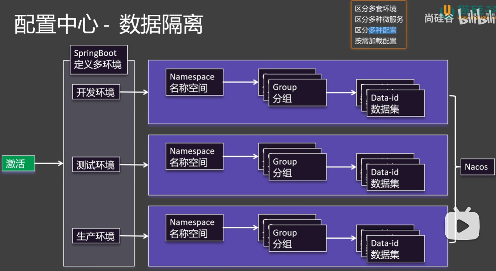
在nacos中，命名空间区分多套环境，group组区分多个微服务，data id区分数据集。在nacos控制台创建即可，并且可通过克隆方式复制。
- 如何实现按需加载---通过yml配置文件实现
```yaml
server:
  port: 8000

spring:
  profiles:
    active: dev # 指定激活环境
  application:
    name: service-order
  cloud:
    nacos:
      server-addr: localhost:8848
      config:
        namespace: ${spring.profiles.active:public} # Nacos 命名空间 :public是无激活则默认public意思

# 这里存在一个小问题：如果不同的环境可能导入的nacos配置文件不同，因此需要实现动态导入
#  config:
#    import:
#      - nacos:common.properties?group=order # nacos: {dataId}?group={group} 区分微服务与数据集
#      - nacos:database.properties?group=order

---
spring:
  config:
    import:
      - nacos:common.properties?group=order # nacos: {dataId}?group={group} 区分微服务与数据集
      - nacos:database.properties?group=order
    activate:
      on-profile: dev

---
spring:
  config:
    import:
      - nacos:common.properties?group=order # nacos: {dataId}?group={group} 区分微服务与数据集
      - nacos:database.properties?group=order
    activate:
      on-profile: test

---
spring:
  config:
    import:
      - nacos:common.properties?group=order # nacos: {dataId}?group={group} 区分微服务与数据集
      - nacos:database.properties?group=order
    activate:
      on-profile: prod
```

### 3.1 openfeign的基本使用
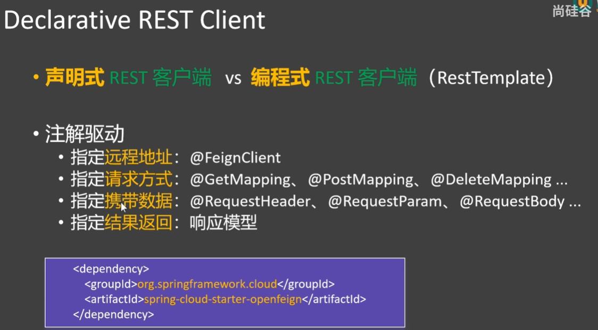
- 编程式调用：从服务发现中获取实例，在到获取url，以及最后的请求都是手动实现的，而声明式调用则是通过注解实现的，这里需要注意。
openfeign的使用步骤（声明式调用）：
- 1. 在services模块中导入openfeign依赖
- 2. 与discoveryClient类似，需要在启动类上加上@EnableFeignClients注解，然后在需要调用的接口上加上@FeignClient注解，value值为调用的微服务名，需要使用product接口可以直接从service-product的controller中把方法签名复制过来即可，下面是一个样例
`````java
@FeignClient(value = "service-product") //  指定需要远程调用的微服务
public interface ProductFeignClient {

    /*
    mvc注解的两套使用逻辑
    1. 标注在Controller上是接受请求
    2. 标注在FeignClient上是发送请求
    */
    @GetMapping("/product/{id}")
    Product getProductBtId(@PathVariable("id") Long id);
}
`````

- 面试题：客户端负载均衡与服务端负载均衡的区别？ 答案：（nacos）客户端负载均衡是在客户端实现负载均衡，（openFeign）服务端负载均衡是在服务端实现负载均衡。   

### 3.2 openfeign的日志
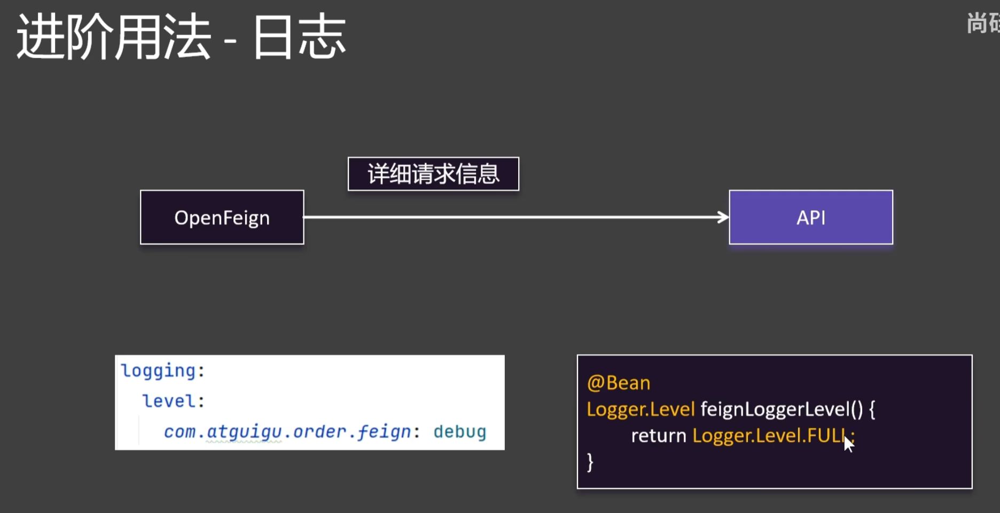
首先在配置文件中配置日志级别，然后在config中加上一个配置类，这个配置类中配置日志级别。
````java
# 日志
logging:
  level:
    com.atguigu.order.feign: debug

//    配置日志级别
@Bean
Logger.Level feignLoggerLevel(){
  return Logger.Level.FULL;
}
````

### 3.3 openfeign的超时设置
默认连接超时10s，读取超时60s。具体设置操作：先创建一个application-feign.yml配置文件，并导入application.properties中即可
````yaml
spring:
  cloud:
    openfeign:
      client:
        config:
          default:
            logger-level: full
            connect-timeout: 1000
            read-timeout: 2000
          service-product:
            logger-level: full
            connect-timeout: 2000
            read-timeout: 3000

# 导入配置文件
spring:
  profiles:
    include: feign
````

### 3.4 openfeign的重试机制
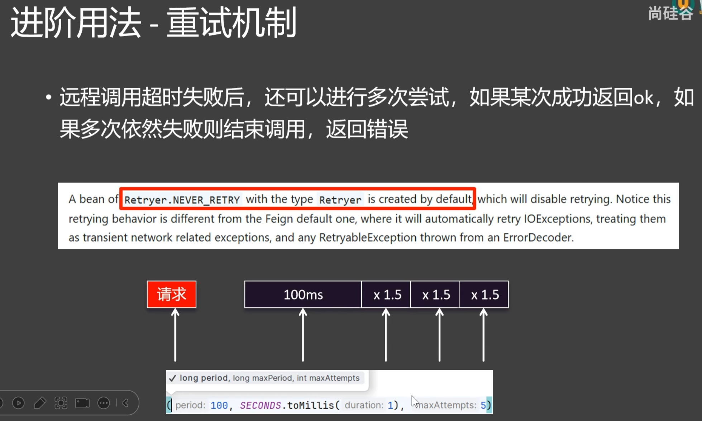
- period重发间隔时间，每次失败x1.5；duration持续时间，超过时间则失败；maxAttempts最大重试次数。

上面是openfeign中存在的8大Bean，其中Retryer是重试机制的Bean，这里需要注意！！openfeign默认不会提供Bean，因此需要自己在config中配置一个Retryer（！类似LoggerLevel）的Bean。
````java
//    openfeign重试器
@Bean
Retryer feignRetryer(){
  return new Retryer.Default();
}
````


### 3.5 openfeign的拦截器机制
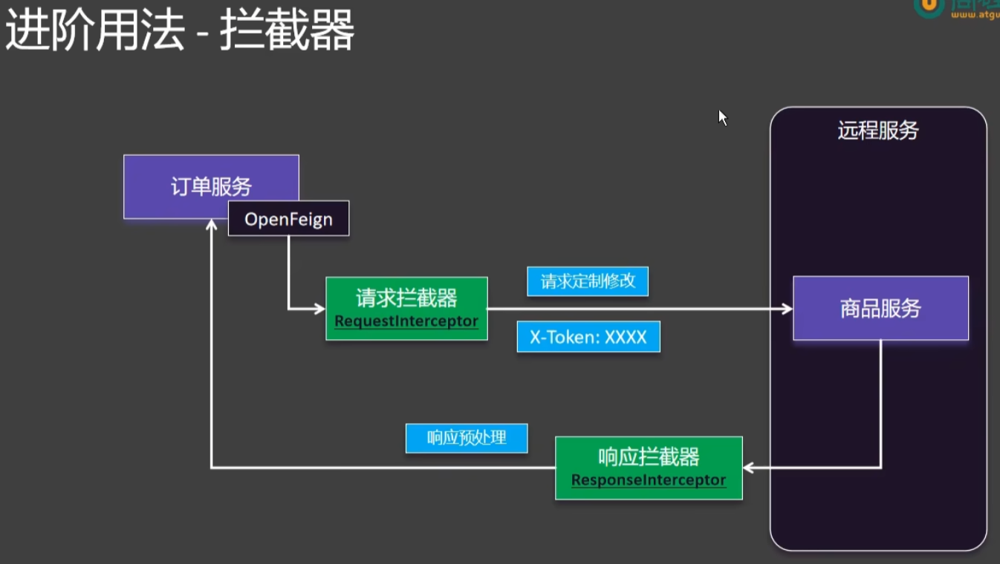
拦截器作用：在请求前后做一些处理，比如修改请求头、打印日志、记录请求时间等。
- 实现步骤：1.创建一个拦截器类，继承RequestInterceptor接口，实现apply方法，2.调用有两种方法修改yml配置文件和加入（推荐与上面一样）spring容器自动注入，
3.在拦截器中实现自己的逻辑即可比如加上验证token，这里可以修改请求头、请求体等。


### 3.6 openfeign的fallback机制需结合sentinel
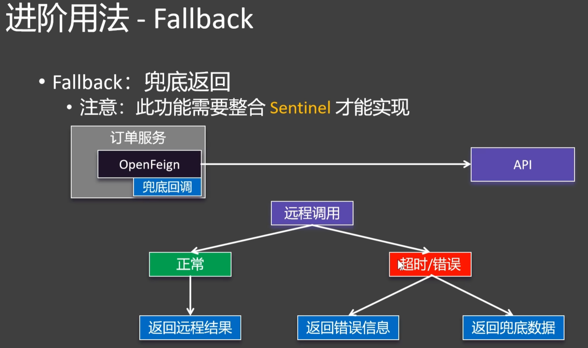
fallback机制：当远程调用失败时，返回一个默认值，而不是抛出异常，这样能提升用户体验。这里需要注意！！fallback机制是在服务端实现的，因此需要在服务端实现fallback逻辑。
- 实现步骤：
1. 在feign目录下创建一个fallback.xxxxxFallback类，实现xxxxFeignClient接口。
2. 类似与serviceImpl实现接口的方法要求返回一个默认值
3. xxxFallback类需要加上@Component注解，交给spring容器管理
4. 在xxxFeignClient的@FeignClient注解中加上fallback属性，指定xxxFallback.class即可。
5. 如果报错，那就需要检测是否有sentinel的依赖，feign.yml配置文件中是否开启sentinel。
