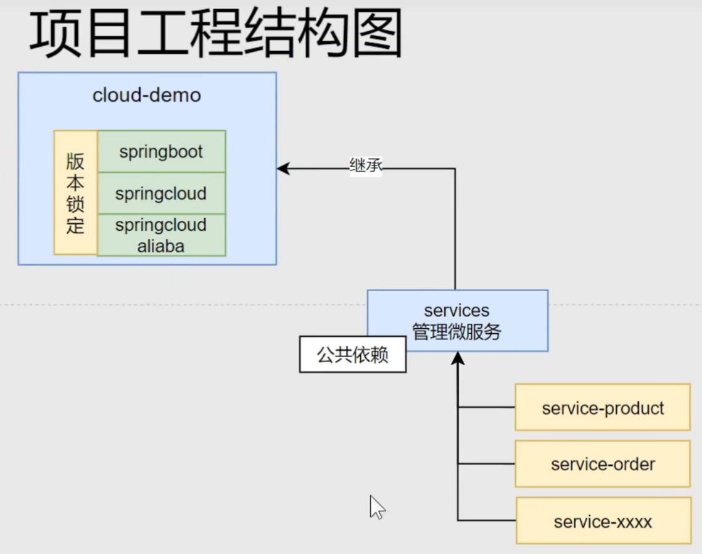
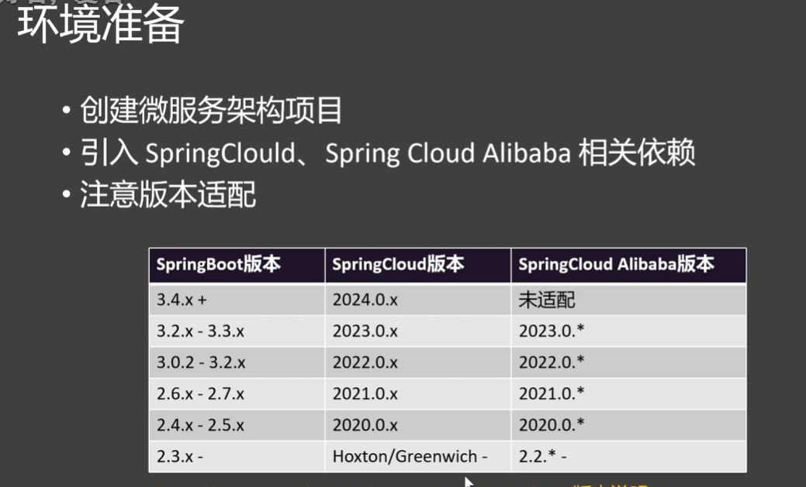

# 尚硅谷springcloud2025从入门到大牛

## 简介微服务的由来

- 传统的单体应用
  传统的单一架构意味着一个处理请求服务器和一个数据库服务器，这种架构的优点是简单，但是随着业务的发展，单体应用的缺点也逐渐暴露出来，比如：
    - 代码耦合度高、臃肿
    - 部署麻烦
    - 可维护性差
    - 可靠性差
    - 无法快速响应业务需求
- 集群架构

为处理高并发的请求，系统部署在多台服务器上，用户通过访问域名网站，由负载均衡器将请求动态分发到不同的服务器上。
集群架构是物理层面上的定义，多台服务器就可以实现。

- 分布式架构

分布式架构是逻辑层面上的定义，将一个大的系统拆分成多个子系统，每个子系统都可以独立部署，独立运行，独立维护。
但是存在一些问题：
- 注册中心：服务的注册与发现 配置中心：配置的统一管理 nacos
- gateway：服务的网关，前端请求的统一入口
- openfeign：服务之间的调用，例：用户服务调用订单服务
- 熔断器：服务的降级与熔断 sentinel
- seata：分布式事务：订单服务调用库存服务，同时成功或失败

## 1. springcloud项目架构

### 1.1 项目创建并修改pom.xml文件进行版本管理

- 创建父工程
  
  首先创建一个父工程选择springboot即可，后续修改父目录下的pom.xml选择项目版本
- 创建services模块
- 创建services下不同的微服务模块：product、order、user
- 微服务模块都需要使用nacos、openfeign组件，因此在services模块中导入依赖，具体见https://www.yuque.com/leifengyang 速通springcloud简介